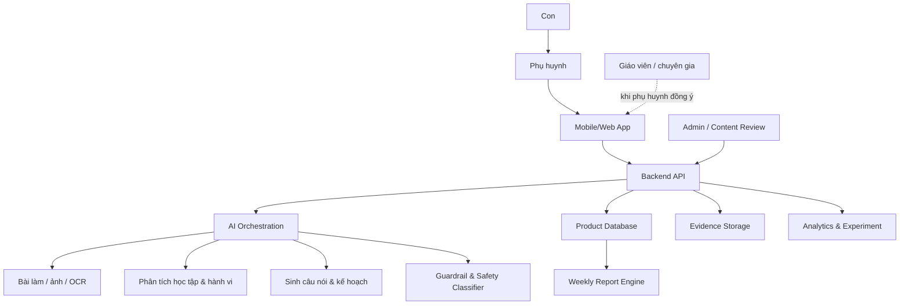
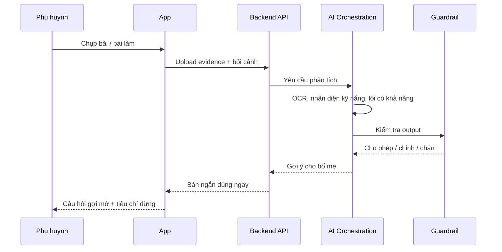
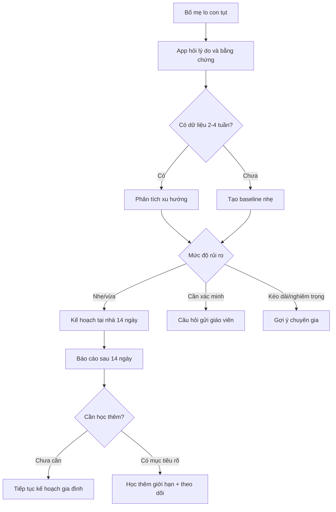

# Kiến Trúc Giải Pháp

## Quan Điểm Kiến Trúc

AI Hiểu Con là hệ thống hỗ trợ quyết định cho phụ huynh, không phải tutor tự động cho trẻ. Kiến trúc phải bảo vệ ba điều:

1. Bố mẹ luôn là người hành động trước mặt con.
2. AI luôn khiêm tốn, có bằng chứng, có guardrail.
3. Dữ liệu trẻ em được tối thiểu hóa, kiểm soát và giải thích được.

## Kiến Trúc Tổng Thể

## 4 Lớp Sản Phẩm

| Lớp | Vai trò | Người thấy trực tiếp |
|---|---|---|
| Lớp hiểu con | Tổng hợp học tập, cảm xúc, thói quen | Bố mẹ |
| Lớp huấn luyện phụ huynh | Câu nói, cách kèm, phản hồi | Bố mẹ |
| Lớp luyện nền | Hoạt động 10-20 phút trong gia đình | Bố mẹ và con |
| Lớp AI hậu trường | Phân tích, sinh kế hoạch, guardrail | Hệ thống và bố mẹ qua kết quả đã biên tập |

## Vai Trò Người Dùng

| Vai trò | Quyền chính | Giới hạn |
|---|---|---|
| Phụ huynh | Tạo hồ sơ, nhập quan sát, chụp bài, xem báo cáo, chia sẻ có chọn lọc | Không nhận chẩn đoán y tế từ app |
| Trẻ | Hưởng lợi qua hoạt động với bố mẹ | Không chat tự do với AI trong MVP |
| Giáo viên | Nhận câu hỏi/tóm tắt nếu phụ huynh chia sẻ | Không truy cập dữ liệu mặc định |
| Chuyên gia | Được gợi ý như tuyến hỗ trợ khi có dấu hiệu kéo dài/nghiêm trọng | Không thay thế quy trình đánh giá chuyên môn |
| Admin/content reviewer | Quản lý nội dung mẫu, guardrail, taxonomy | Không xem dữ liệu cá nhân nếu không có quyền rõ |

## Module Triển Khai

### Frontend App

Trách nhiệm:

- Onboarding.
- Chụp bài/nhập tình huống.
- Hiển thị kế hoạch 15 phút.
- Trải nghiệm huấn luyện câu nói.
- Báo cáo tuần.
- Privacy controls.

Yêu cầu:

- Mobile-first.
- Nội dung ngắn, một hành động chính mỗi màn hình.
- Có chế độ giảm tải khi con/bố mẹ mệt.

### Backend API

Trách nhiệm:

- Xác thực và phân quyền.
- Quản lý child profile, parent profile, session log.
- Điều phối AI jobs.
- Lưu evidence và report.
- Cung cấp audit log cho dữ liệu nhạy cảm.

### AI Orchestration

Trách nhiệm:

- Chuẩn hóa input.
- Gọi OCR/vision nếu có ảnh bài làm.
- Phân tích lỗi học tập.
- Phân tích tín hiệu cảm xúc/hành vi từ ghi chú.
- Sinh câu nói, kế hoạch, báo cáo.
- Chạy guardrail trước khi trả kết quả.

### Content & Safety Admin

Trách nhiệm:

- Quản lý mẫu câu nói.
- Quản lý taxonomy kỹ năng nền.
- Review prompt/output mẫu.
- Theo dõi false positive/false negative của guardrail.

## Data Model Khái Niệm

| Entity | Mục đích | Trường chính |
|---|---|---|
| ParentProfile | Cá nhân hóa hướng dẫn cho bố mẹ | vai trò, mức tự tin, thời gian rảnh, phong cách mong muốn |
| ChildProfile | Hiểu bối cảnh trẻ | tuổi, lớp, giai đoạn, mục tiêu, điểm cần quan sát |
| LearningEvidence | Bằng chứng học tập | ảnh bài, OCR, loại bài, kỹ năng liên quan, lỗi có khả năng |
| Observation | Quan sát của phụ huynh | cảm xúc, hành vi, mức hợp tác, ghi chú phiên học |
| SupportSession | Một phiên đồng hành | mục tiêu, kế hoạch, câu nói, kết quả, tiêu chí dừng |
| ParentSkill | Năng lực phụ huynh | kỹ năng đã học, số lần áp dụng, phản hồi hiệu quả |
| WeeklyReport | Báo cáo tuần | tiến bộ của con, tiến bộ của bố mẹ, ưu tiên tuần tới |
| SafetyFlag | Cờ an toàn | loại rủi ro, mức độ, hành động khuyến nghị |

## Luồng Chụp Bài

## Luồng Giảm Học Thêm

## Failure Modes Cần Thiết Kế

| Failure mode | Hệ quả | Cách xử lý |
|---|---|---|
| OCR sai bài | Gợi ý sai | Cho phép phụ huynh sửa/nhập lại đề, hiển thị mức chắc chắn thấp |
| AI kết luận quá chắc | Mất niềm tin, rủi ro tâm lý | Bắt buộc dùng “có thể”, “một khả năng”, evidence tags |
| Bố mẹ nhập quá ít dữ liệu | Gợi ý chung chung | Trả lời bản tối thiểu và hỏi 1-2 câu bổ sung |
| Trẻ quá tải cảm xúc | Giờ học căng hơn | Chuyển sang chế độ điều tiết, khuyến nghị nghỉ |
| Dữ liệu nhạy cảm bị chia sẻ nhầm | Rủi ro quyền riêng tư | Share explicit consent, preview trước khi gửi |

