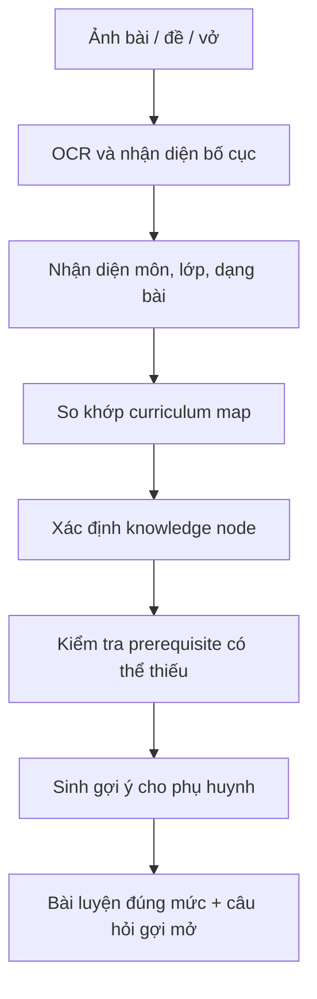

# Giáo Trình, Chuẩn Môn Học Và Knowledge Graph

## Vì Sao Đây Là Năng Lực Lõi

Phụ huynh không chỉ cần app “hiểu cảm xúc của con”. Họ cần app hiểu đúng con đang học lớp mấy, theo chương trình nào, sách nào, chủ đề nào, và bài đang kiểm tra kỹ năng gì. Nếu không có lớp curriculum này, mọi gợi ý bài luyện rất dễ chung chung hoặc vô tình đi trước/đi lệch chương trình.

Mục tiêu của curriculum engine là biến một ảnh bài học, một câu hỏi của phụ huynh hoặc một buổi luyện ngắn thành vị trí rõ ràng trên bản đồ học tập của con.

## Phạm Vi Ưu Tiên

| Giai đoạn | Phạm vi | Ghi chú |
|---|---|---|
| MVP | CTGDPT 2018, Tiếng Việt và Toán lớp 1-2, các bộ SGK phổ biến | Là bản đồ conceptual/taxonomy trước, chưa cần ingest toàn bộ SGK |
| Sau MVP | Lớp 3-5, Tiếng Anh, Tự nhiên và Xã hội, kỹ năng học tập | Mở rộng theo nhu cầu sử dụng thật |
| Mở rộng | Giáo trình quốc tế, sách riêng, lộ trình homeschool | Dùng adapter để map về cùng knowledge graph |

## Hồ Sơ Học Tập Của Con

`ChildLearningProfile` là lớp dữ liệu giúp app hiểu “con đang ở đâu” trước khi sinh lời khuyên.

| Trường | Ý nghĩa | Cách dùng |
|---|---|---|
| `gradeLevel` | Lớp hiện tại hoặc giai đoạn tiền tiểu học | Giới hạn độ khó, tránh học trước quá mức |
| `schoolProgram` | CTGDPT 2018, song ngữ, quốc tế, homeschool | Chọn curriculum map phù hợp |
| `textbookSet` | Bộ SGK/giáo trình nếu phụ huynh biết | Định vị bài theo chương/chủ đề |
| `subjects` | Môn đang theo dõi | Cá nhân hóa dashboard và gợi ý |
| `currentLearningGoals` | Mục tiêu 2-4 tuần | Tránh giao bài lan man |
| `knownConstraints` | Thời gian, lịch học thêm, sức khỏe, thói quen | Điều chỉnh kế hoạch thực tế |

## Curriculum Map

`CurriculumMap` mô tả chuẩn học theo môn, lớp, học kỳ, chủ đề và kỹ năng. Đây không phải kho bài tập đơn thuần mà là bản đồ ý nghĩa để AI định vị và suy luận.

| Lớp bản đồ | Ví dụ | Vai trò |
|---|---|---|
| Môn học | Toán, Tiếng Việt | Chọn taxonomy đúng |
| Lớp/học kỳ | Lớp 1, học kỳ 1 | Giới hạn tiến trình |
| Chủ đề | Số trong phạm vi 10, âm/vần, câu kể | Định vị bài |
| Chuẩn đầu ra | Đọc đúng tiếng có vần đã học, tách-gộp số | Biết bài kiểm tra kỹ năng gì |
| Knowledge node | Tách số 8, đọc vần “an”, viết câu ngắn | Đơn vị cá nhân hóa |
| Prerequisite | Đếm có ý nghĩa trước cộng, nghe âm đầu trước ghép vần | Tìm nguyên nhân gốc |
| Dạng bài | Điền số, nối hình, đọc tiếng, đặt câu | Sinh bài luyện phù hợp |

## Knowledge Node Contract

Mỗi node cần đủ dữ liệu để phục vụ nhận diện, gợi ý và kiểm thử.

```json
{
  "id": "math.g1.number-bonds.within-10.split-8",
  "subject": "Toán",
  "grade": 1,
  "topic": "Tách gộp số trong phạm vi 10",
  "skill": "Tách số 8 thành hai phần",
  "outcome": "Con biểu diễn và giải thích được các cách tách số 8",
  "prerequisites": [
    "math.g1.counting.meaningful-counting",
    "math.g1.number-comparison.within-10"
  ],
  "commonMistakes": [
    "Đếm thuộc lòng nhưng không gắn với số lượng",
    "Nhầm giữa tách số và phép cộng",
    "Chỉ nhớ một cặp số quen thuộc"
  ],
  "practiceTypes": [
    "thao tác với vật thật",
    "vẽ chấm tròn",
    "điền cặp số còn thiếu"
  ]
}
```

## Luồng Định Vị Khi Chụp Bài



Kết quả trả cho phụ huynh phải dùng ngôn ngữ đời thường:

- Bài này thuộc phần nào.
- Bài đang kiểm tra kỹ năng gì.
- Con có thể đang vướng ở bước nào.
- Có prerequisite nào nên kiểm tra nhẹ.
- Hôm nay nên luyện một hoạt động ngắn nào.
- Khi nào nên dừng để tránh quá tải.

## Sinh Bài Luyện Phù Hợp

App chỉ sinh bài luyện khi có đủ bối cảnh tối thiểu: lớp/chương trình, node kiến thức, mức chắc chắn, năng lực gần đây của con và mục tiêu buổi học.

| Tín hiệu đầu vào | Quyết định của app |
|---|---|
| Con mới sai dạng bài lần đầu | Gợi ý hỏi lại và thao tác với vật thật, chưa kết luận lỗ hổng |
| Con sai lặp lại cùng prerequisite | Lùi một node, luyện nền 5-10 phút |
| Con làm đúng nhưng căng thẳng | Giữ độ khó, đổi cách tương tác |
| Con làm nhanh và giải thích được | Mở rộng nhẹ bằng câu hỏi vì sao/cách khác |
| Phụ huynh muốn luyện thêm nhiều | Giới hạn theo tiêu chí dừng, tránh biến nhà thành lớp học thêm |

## Guardrail Curriculum

- Không khuyến khích học trước lớp 1 hoặc luyện đề sớm.
- Không tăng độ khó chỉ vì phụ huynh lo con thua bạn.
- Không coi một ảnh bài làm là kết luận năng lực tổng quát.
- Không dùng tên bộ sách để khóa cứng trải nghiệm; luôn cho phụ huynh sửa.
- Không sao chép nguyên văn nội dung SGK có bản quyền vào kho bài tập.

## Acceptance Criteria

| Năng lực | Tiêu chí đạt |
|---|---|
| Onboarding curriculum | Phụ huynh có thể nhập lớp, chương trình, bộ sách trong dưới 2 phút và có lựa chọn “chưa biết” |
| Định vị bài học | Với ảnh rõ, app trả về môn, lớp/chủ đề, knowledge node và mức chắc chắn |
| Prerequisite | App nêu được 1-2 prerequisite cần kiểm tra nhẹ khi con sai |
| Bài luyện | Bài luyện bám node, độ khó vừa sức, có hoạt động không cần in giấy |
| Explainability | Mỗi gợi ý học tập có “vì sao app nghĩ vậy” bằng ngôn ngữ phụ huynh |

