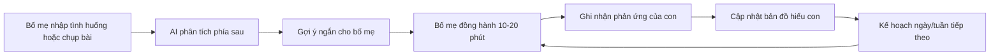

# Tổng Quan Giải Pháp

AI Hiểu Con là ứng dụng dành cho phụ huynh Việt Nam có con tiền tiểu học và tiểu học. Sản phẩm giúp bố mẹ hiểu con đang học và cảm thấy thế nào, biết hỗ trợ con trong 10-20 phút mỗi ngày, cải thiện giao tiếp trong gia đình, và ra quyết định bình tĩnh hơn trước việc học thêm.

> AI là người hỗ trợ thầm lặng phía sau. Với con, bố mẹ là người đồng hành bình tĩnh, thấu hiểu và đáng tin cậy.

## Vấn Đề Cốt Lõi

Phụ huynh không thiếu tình yêu hay trách nhiệm. Họ thiếu một hệ thống giúp trả lời các câu hỏi rất đời thường:

- Con đang vướng kiến thức, thiếu nền tảng, mệt, sợ sai hay thiếu tập trung?
- Tối nay bố/mẹ nên làm gì trong 15 phút?
- Nên nói với con thế nào khi con khóc, né học hoặc làm sai nhiều lần?
- Có thật sự cần học thêm không, hay gia đình có thể thử kế hoạch tại nhà trước?
- Làm sao nhìn thấy tiến bộ của con mà không chỉ dựa vào điểm số?

## Luận Điểm Sản Phẩm

| Thực tế thị trường | Quyết định sản phẩm |
|---|---|
| App học tập thường bắt đầu từ môn học và bài tập | AI Hiểu Con bắt đầu từ đứa trẻ, bố mẹ và bối cảnh gia đình |
| Học thêm mua sự yên tâm và trách nhiệm tiến độ | App phải tạo vòng lặp đo nhẹ, làm ngắn, ghi nhận, điều chỉnh |
| Phụ huynh sợ mình dạy sai hoặc làm con áp lực | App huấn luyện bố mẹ bằng câu nói, cách hỏi, cách chia nhỏ |
| Trẻ nhỏ cần an toàn cảm xúc trước khi học sâu | App ưu tiên điều tiết cảm xúc khi có tín hiệu quá tải |

## Vòng Lặp Cốt Lõi

## Cách Đọc Portal

- Đọc [Nghiên cứu insight](/vi/research/) để hiểu vì sao phụ huynh chi tiền cho học thêm và chưa tự tin ở đâu.
- Đọc [PRD sản phẩm](/vi/prd/) để nắm yêu cầu chức năng, hành trình người dùng và acceptance criteria.
- Đọc [Kiến trúc giải pháp](/vi/architecture/) để triển khai hệ thống sản phẩm, AI, dữ liệu và module backend/frontend.
- Đọc [AI, guardrails và dữ liệu](/vi/ai-data/) để hiểu cách giữ AI ở hậu trường, an toàn, minh bạch.
- Đọc [MVP và roadmap](/vi/mvp/) để biết thứ tự triển khai.
- Đọc [Nghiệm thu](/vi/acceptance/) để dùng checklist kiểm thử và tiêu chí thành công.

