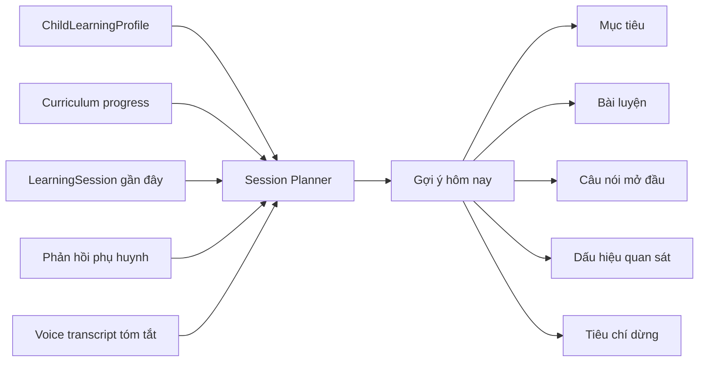
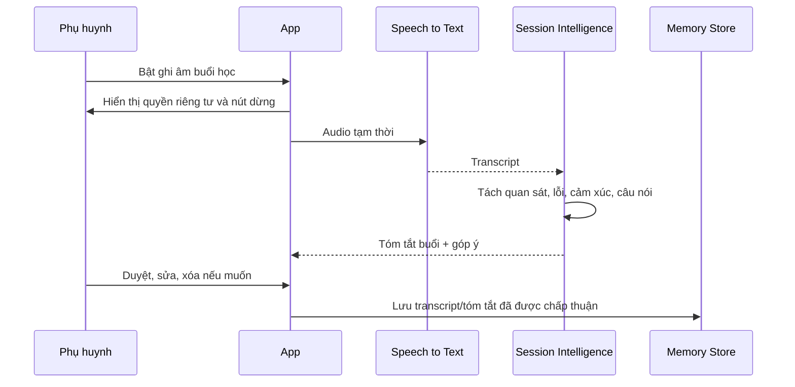

# Hành Trình Học, Phản Hồi Sau Buổi Và Voice Context

## Mục Tiêu

AI Hiểu Con không nên trả lời từng phiên như một công cụ hỏi đáp rời rạc. Sản phẩm cần nhớ có kiểm soát: buổi trước con làm gì, vướng gì, cảm xúc thế nào, bố mẹ đã thử câu nói nào, điều gì hiệu quả, điều gì nên tránh.

Memory engine giúp mỗi buổi mới bắt đầu bằng một gợi ý vừa đủ: mục tiêu hôm nay, bài luyện phù hợp, câu nói mở đầu, dấu hiệu cần quan sát và tiêu chí dừng.

## Learning Session

`LearningSession` là đơn vị trung tâm của hành trình học tại nhà.

| Trường | Ý nghĩa |
|---|---|
| `sessionGoal` | Mục tiêu chính của buổi học |
| `curriculumNodes` | Knowledge node liên quan |
| `activitiesDone` | Bài/hoạt động đã làm |
| `errorsObserved` | Lỗi hoặc điểm vướng |
| `emotionalSignals` | Cảm xúc, hợp tác, quá tải |
| `parentPromptsTried` | Câu nói/cách hỏi bố mẹ đã thử |
| `result` | Hoàn thành, dừng sớm, cần lùi độ khó |
| `stopReason` | Vì hết giờ, con mệt, con cáu, đã đạt mục tiêu |
| `nextHypothesis` | Giả thuyết nhẹ cho buổi sau |

## Gợi Ý Trước Mỗi Buổi

Gợi ý hôm nay phải ngắn. Một màn hình chính là đủ. Nếu bố mẹ cần phân tích sâu, app mở lớp giải thích phía sau.

## Phản Hồi Sau Buổi

Sau mỗi buổi, app hỏi 3-5 câu ngắn để cập nhật context:

1. Hôm nay con làm được điều gì?
2. Con vướng ở đâu hoặc dừng ở bước nào?
3. Cảm xúc của con trong buổi học thế nào?
4. Bố/mẹ đã thử câu nói hoặc cách hỗ trợ nào?
5. Buổi sau nên giảm, giữ hay tăng độ khó?

Phản hồi này cập nhật ba lớp:

| Lớp | Cập nhật |
|---|---|
| Learning progress | Node đã chạm tới, mức chắc chắn, lỗi lặp lại |
| Parent coaching progress | Cách nói đã thử, hiệu quả, tình huống khó |
| Next session plan | Mục tiêu tiếp theo, độ khó, thời lượng, tiêu chí dừng |

## Voice Input Cho Phụ Huynh

Voice giúp giảm typing trong bối cảnh rất thật: buổi tối mệt, tay đang cầm vở, con đang đợi, phụ huynh không muốn gõ dài.

Use cases ưu tiên:

- Ghi chú nhanh: “Hôm nay con đọc được 5 dòng nhưng khóc khi sai”.
- Hỏi app: “Bài này nên giải thích thế nào cho con lớp 1?”.
- Phản hồi sau buổi bằng giọng nói.
- Đọc tình huống để app viết lại thành câu nói bình tĩnh hơn.

## Ghi Âm Buổi Học Opt-In

Chế độ ghi âm buổi học chỉ bật khi phụ huynh chủ động đồng ý. Mục tiêu không phải giám sát trẻ, mà là giúp app hiểu bối cảnh tương tác để góp ý cho phụ huynh.

Mặc định sản phẩm ưu tiên transcript và tóm tắt. Audio gốc nên bị xóa sau xử lý hoặc theo thời hạn ngắn do phụ huynh chọn.

## Privacy Và Trust

| Nguyên tắc | Thiết kế |
|---|---|
| Opt-in rõ ràng | Không tự bật ghi âm, không dùng dark pattern |
| Kiểm soát dữ liệu | Phụ huynh xem, sửa, tải, xóa transcript, summary và audio nếu còn lưu |
| Tối thiểu hóa | Lưu structured observations thay vì audio dài hạn khi có thể |
| Không chẩn đoán | Không suy luận bệnh lý từ giọng nói, tốc độ nói, khóc hoặc im lặng |
| Minh bạch | App nói rõ dữ liệu nào dùng cho gợi ý buổi sau |

## Guardrail Voice

- Không phân tích trẻ bằng nhãn bệnh lý.
- Không biến ghi âm thành công cụ chấm điểm bố mẹ.
- Không lưu audio gốc lâu dài mặc định.
- Không chia sẻ transcript với giáo viên/chuyên gia nếu phụ huynh chưa preview và đồng ý.
- Không dùng voice session để tạo áp lực học nhiều hơn.

## Acceptance Criteria

| Năng lực | Tiêu chí đạt |
|---|---|
| Gợi ý trước buổi | Dựa trên ít nhất một session gần đây hoặc nói rõ khi chưa đủ dữ liệu |
| Phản hồi sau buổi | Hoàn tất trong dưới 90 giây, có cả lựa chọn voice và tap nhanh |
| Voice input | Transcript có thể sửa trước khi lưu |
| Ghi âm opt-in | Có thông báo rõ, nút dừng dễ thấy, chính sách xóa audio rõ ràng |
| Session summary | Tách được mục tiêu, bài đã làm, lỗi, cảm xúc, câu nói đã thử và gợi ý lần sau |

